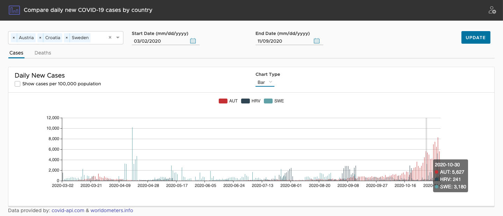

# covid19-compare
Angular 10 /Spring Boot/Spring Batch App enabling users to compare the daily 
Covid-19 statistics side-by-side by country.

Includes docker-compose.yml for easy local development.

##### **Frontend**
###### Angular 10 UI using [ngx-echarts](https://github.com/swimlane/ngx-charts).
##### Backend
###### Springboot REST Controllers, JPA and Postgres. 
##### Batch Jobs
###### Springboot, Spring Batch (using remote-chunking), Spring Integration, Rabbit MQ
- ###### Init Countries Job
  - Retrieves list of countries from covid-api.com and stores them in
   Postgres Database.
- ###### Init Country Data Job
  - Retrieves covid19 daily statistics between given start and end dates 
  for all countries in the country table from covid-api.com and stores them in Postgres Database. Utilizes 
  spring batch remote-chunking to improve performance.
- ###### Update Daily Stats Job
  - Uses the web scraper to retrieve todays country stats from worldometer and stores 
  them in Postgres Database.

##### Web Scraper
- Uses [htmlunit](https://github.com/HtmlUnit/htmlunit) to extract data from [worldometer](https://www.worldometers.info/)
### Preview

###### Screenshot of bar chart comparison view

###### Screenshot of line chart comparison view

### Demo
[http://www.covidcompare.info](http://www.covidcompare.info)

